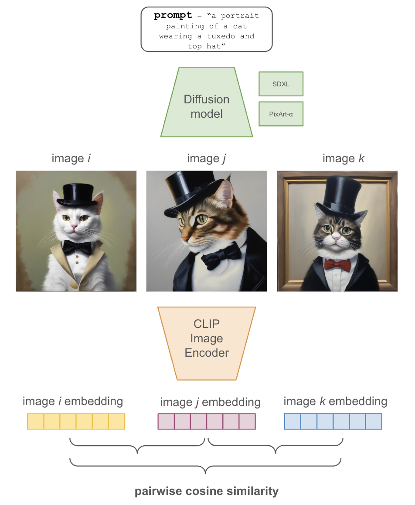

# Semantic Consistency Score

[[Paper]]() [[Dataset]](https://huggingface.co/datasets/runsdata/semantic-consistency-score)

This study introduces a new, interpretable, quantitative metric known as the Semantic Consistency Score, aimed at measuring the repeatability or consistency of image generation in diffusion models. By utilizing a pairwise mean CLIP (Contrastive Language-Image Pretraining) score, this method provides a novel approach to assess and compare the performance of image generation models on a semantic level.

We apply this metric to evaluate two leading open-source image generation diffusion models: Stable Diffusion XL (SDXL) and PixArt-α. Our findings reveal statistically significant differences in their semantic consistency scores, with PixArt-α demonstrating higher consistency in image generation. Furthermore, we compare the consistency of SDXL with a LoRA-fine-tuned version of SDXL, uncovering a significant improvement in semantic consistency in the fine-tuned model. This Semantic Consistency Score facilitates the evaluation of model architectures for specific tasks and supports informed decision-making in model selection.

## Approach



## Usage

#### Setup

Ensure your system has Python 3.6 or newer installed. This project has been tested on CUDA GPU machines, but it should be compatible with CPU-only setups as well (with adjusted performance expectations).

1. **Clone the Repository**: First, clone this repository to your local machine using Git.

2. **Create a Conda Environment**:
   
```bash
   conda create --name semantic-score-env python=3.8
   conda activate semantic-score-env
```

3. **Install Dependencies:**

```bash
conda install pytorch=2.2.1 torchvision=0.17.1 cudatoolkit=11.0 -c pytorch
pip install -r requirements.txt
```

4. **Update Environment Variables:**

Duplicate the .env_example file, rename it to .env, and fill in the necessary details.


#### Dataset Generation
To generate data, refer to the data-generation subrepository. This contains `run_generate.py` to create datasets. 

Alternatively, all data used in the study is a Hugging Face Dataset, available here: [[Dataset]](https://huggingface.co/datasets/runsdata/semantic-consistency-score) or run the code below:

```python
from datasets import load_dataset
dataset = load_dataset("runsdata/semantic-consistency-score")
```

#### Semantic Score
To generate semantic scores for your data, refer to `run_score.py`. For additional details, see `semantic_score.py`.

#### Annotations
Code for annotations is available in the annotations subrepository. 

#### Replicating Paper Analysis
Code for the statistical analysis and plots generated for the paper are located in `analysis.py` and `plots.py`, respectively.

#### LoRA Weights
Due to the size of the LoRA weights, they are available upon request. Send me an email and I will send a temporary link.

